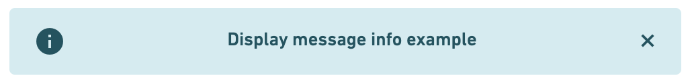

# IonDisplayMessages

This library was generated with [Angular CLI](https://github.com/angular/angular-cli) version 8.2.14.

## Installation

```bash
npm install ion-display-messages
```

### Module
```node
IonDisplayMessagesModule
```
### Component

```node
IonDisplayMessagesComponent
```

## Usage

```html
<lib-ion-display-messages
    [isVisible]="condition" 
    [dismissible]="true" 
    [icon]="true" 
    [type]="'error'">
        {{errorMessage}}
</lib-ion-display-messages>
```

## Attributes

| Atribute | type |
| :------------- | :-------------: |
| isVisible | boolean |
| dismissible | boolean |
| icon | boolean |
| type | 'success'/'info'/'warning'/'error' |

### Default values

| Atribute | values |
| :------------- | :-------------: |
| isVisible | true |
| dismissible | true |
| icon | true |
| type | 'info' |

## Examples





## Code scaffolding

Run `ng generate component component-name --project ion-display-messages` to generate a new component. You can also use `ng generate directive|pipe|service|class|guard|interface|enum|module --project ion-display-messages`.
> Note: Don't forget to add `--project ion-display-messages` or else it will be added to the default project in your `angular.json` file. 

## Build

Run `ng build ion-display-messages` to build the project. The build artifacts will be stored in the `dist/` directory.

## Publishing

After building your library with `ng build ion-display-messages`, go to the dist folder `cd dist/ion-display-messages` and run `npm publish`.

## Running unit tests

Run `ng test ion-display-messages` to execute the unit tests via [Karma](https://karma-runner.github.io).

## Further help

To get more help on the Angular CLI use `ng help` or go check out the [Angular CLI README](https://github.com/angular/angular-cli/blob/master/README.md).
